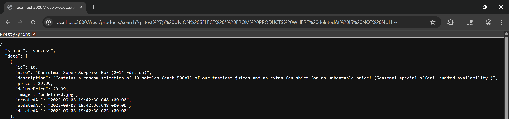
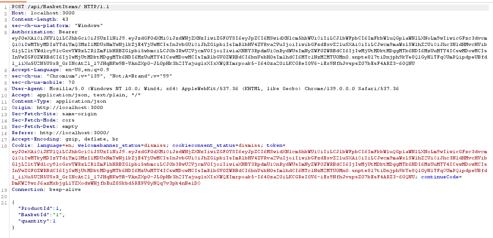

# Christmas Special

The goal of this challenge was to exploit an SQL Injection to access a hidden Christmas offer product that was presumably removed or hidden from the normal product listing (marked as deleted in the database).

First thing first, use this url to exploit the databases `localhost:3000/rest/products/search?q=payload` 
And after that we inject with query `test')) UNION SELECT * FROM PRODUCTS WHERE deletedAt IS NOT NULL--` to find the missing product. And here we are, as you can see below is the christmas product that already removed in the catalogue.

The product contains `id=10` means that we can exploit it. Next we go to our catalogue again and turn on your intercept and add a random stuff to your basket. 

As you can see, I'm buying product `id=1` so if we want to buy that christmas box we need to change it to `id=10` and here we go

.png>)

As we already have it on our basket, let's checkout it and we solved the challenge.

.png>)