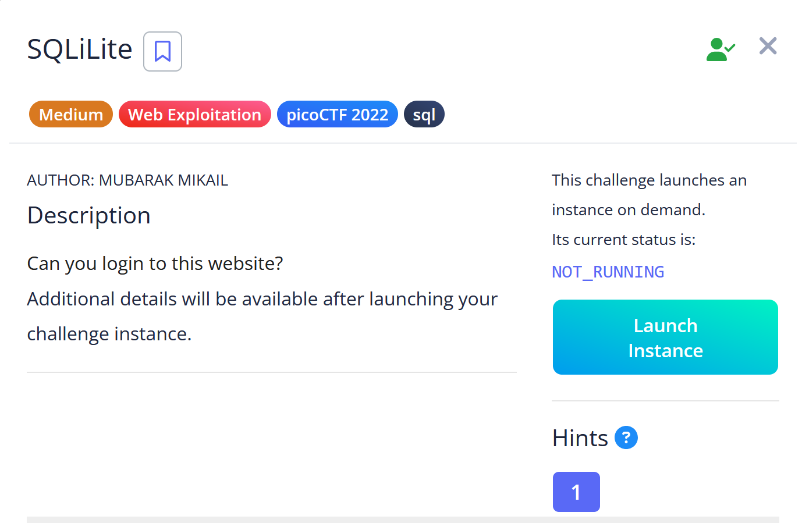

# SQLiLite
Resource : https://play.picoctf.org/practice/challenge/304?page=1&search=sql 

We are asked to login using a username and password so this must be something that is related to SQL Injections.

You can inject it with the `OR 1==1 — —` payload like this

And eventually you will Logged In and saw this information

You can see the flag if you inspect it, like this

